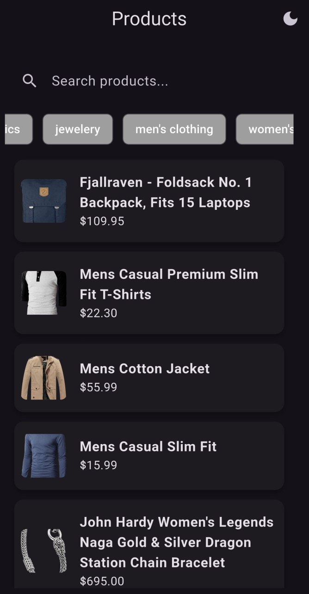
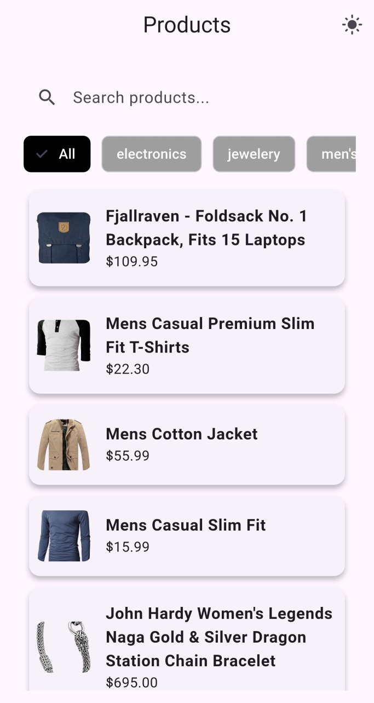
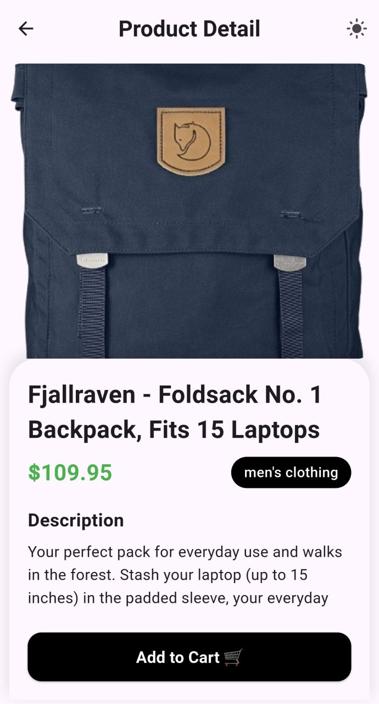
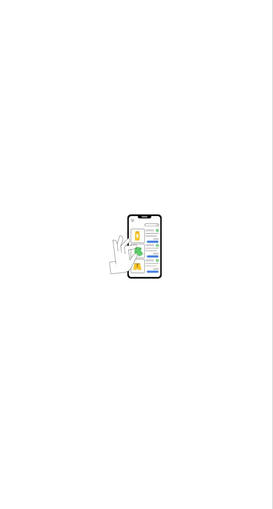

# 🛍️ Mini Catalog App

A small product catalog app built with **Flutter** and **BLoC**, supporting search, category filter, pagination, offline cache, and error handling.

---

## 📱 Screenshots

### 🟢 Splash & Login

 

### 🏠 Home & Product Details

 

## ⚙️ Flutter Version

- **Flutter:** 3.35.2
- **Dart:** Null-safety enabled

---

## 🚀 How to Run

1. **Clone the repository**

```bash
git clone https://github.com/yaftes/mini-catalog
cd mini_catalog


💾 Caching & Pagination Design
    Caching:

    App displays cached data when offline, ensuring the user always sees something even without internet.

    also supports pagination

    Supports infinite scroll or "Load More" button.

    Pull-to-refresh resets paging and fetches latest data.


🛠️ Additional Libraries & Why They Are Used

    get_it: Service locator for dependency injection → makes BLoC, repositories, and data sources easy to manage and test.

    dartz: Functional programming (Either type) → clean handling of success/failure without throwing exceptions.

```
